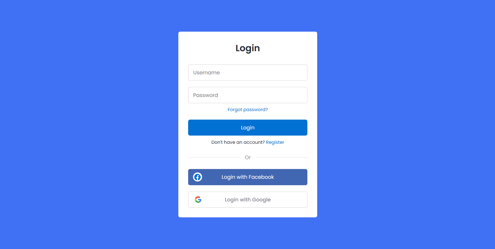
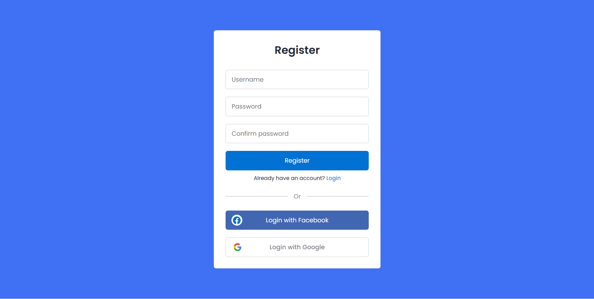

# NodeAuth JWT Authentication

NodeAuth is a Node.js and Express authentication project built with JWT, MongoDB, bcrypt, and Handlebars. It includes signup, signin, logout, forgot password, reset password, and an authenticated dashboard that shows the logged-in username in the header.

## Features

- JWT-based authentication with HTTP-only cookies
- Signup and signin flow
- Username shown in the header after login
- Logout and session cleanup
- Forgot password and reset password flow
- Styled popup notifications for success and error messages
- Responsive dashboard-style home page

## Tech Stack

- Node.js
- Express.js
- MongoDB and Mongoose
- Handlebars
- bcrypt
- jsonwebtoken
- cookie-parser

## Project Structure

```text
Nodeauth/
  public/
    css/
    images/
  src/
    app.js
    db/
    models/
  templates/
    partials/
    views/
  images/
```

## Setup

1. Install dependencies:

```bash
npm install
```

2. Create a `.env` file in the project root and add:

```env
PORT=1000
JWT_SECRET=your_secret_key_here
RESET_TOKEN_SECRET=your_reset_secret_here
```

3. Make sure MongoDB is running locally on:

```text
mongodb://127.0.0.1:27017/Website-register
```

4. Start the app:

```bash
npm run dev
```

5. Open the browser at:

```text
http://localhost:1000
```

## Screenshots

### Home Page


### Login Page



### Registration Page



### Forgot Password


### Logged-in User View


### Token Stored in Database


## Authentication Flow

1. User signs up with username and password.
2. The password is hashed using bcrypt before saving.
3. A JWT token is generated and stored in an HTTP-only cookie.
4. The dashboard/home page reads the token and shows the username in the header.
5. Forgot password generates a reset token.
6. Reset password updates the password and clears the reset token.

## Notes

- The forgot-password flow currently generates a reset link on the page.
- If you want email delivery later, you can add Nodemailer.
- The dashboard page is protected and redirects to signin when the user is not authenticated.

## License

ISC
